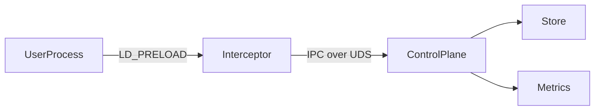
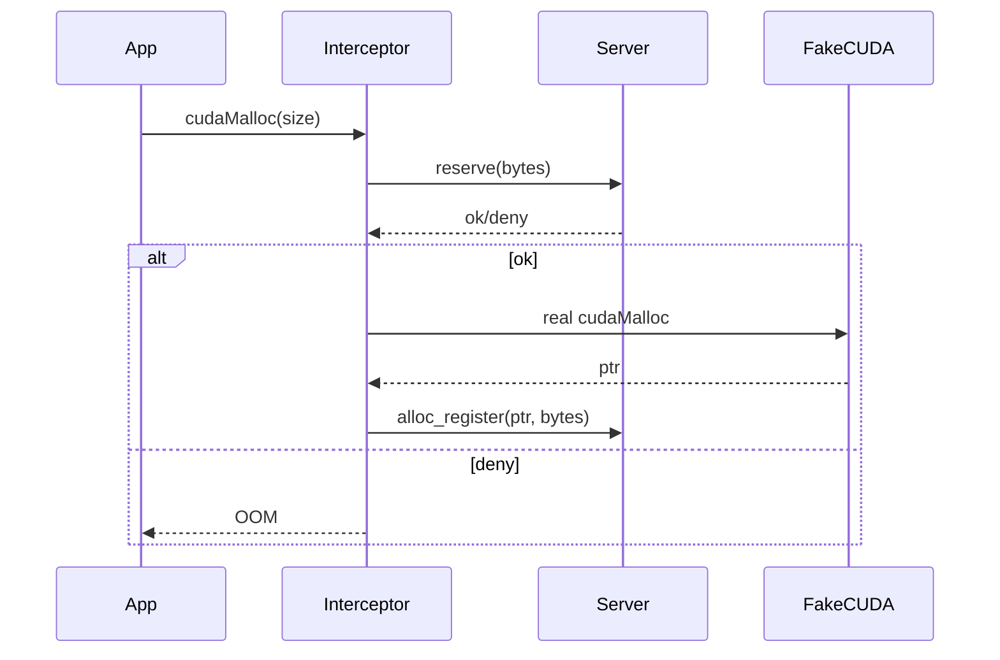
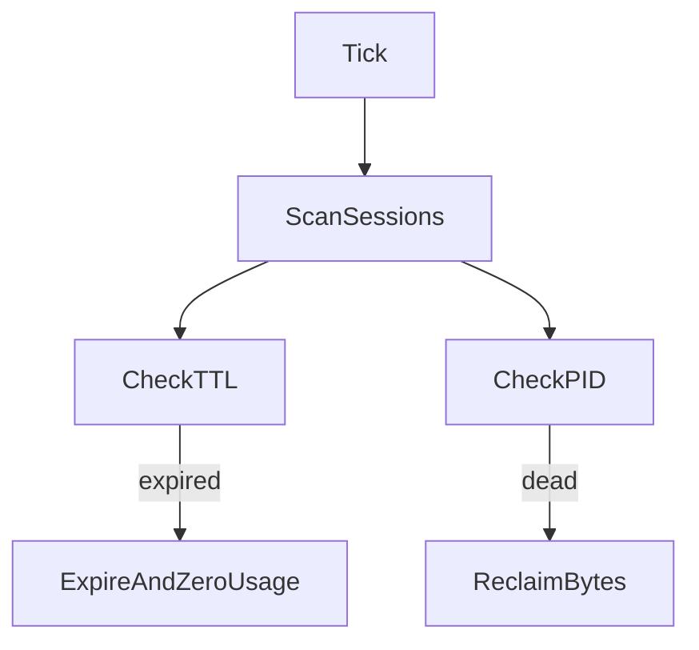

<h1>GPU Slice</h1>

<div align="center">
  

  <p>
    
    
    
    <a href="https://discord.gg/nnkfW83n"></a>
    
  </p>
</div>

## Overview
GPU Slice enforces **per-session GPU memory quotas** for CUDA-style alloc/free APIs on Linux.

It provides:
- A Go control plane (session lifecycle, quota accounting, recovery, metrics, API/CLI).
- A C LD_PRELOAD interceptor (`libgpuslice.so`) for allocation-time enforcement.
- A fake CUDA runtime (`libfakecuda.so`) for deterministic no-GPU testing.

It **does not** provide:
- Compute scheduling / time slicing.
- Kernel launch interception.
- Multi-node coordination.
- Hardware partitioning.

## Architecture

### High level


### Allocation flow


### Recovery loop


## Components
- **Control Plane (Go):** session CRUD, reserve/release logic, TTL reaper, orphan recovery, HTTP API.
- **Interceptor (C):** hooks `cudaMalloc`, `cudaFree`, `cudaMallocManaged`, `cudaMallocPitch`; performs IPC checks.
- **Fake CUDA (C):** deterministic mock allocator for CI/local use.
- **CLI:** allocate/status/release/list and run helper.
- **Metrics:** Prometheus endpoint with cardinality-safe defaults.
- **Recovery:** `/proc/<pid>` based orphan allocation reclaim.

## Security model
- IPC uses **Unix domain socket** (`0600`).
- Optional/required shared token: `GPUSLICE_IPC_TOKEN` (+ `GPUSLICE_IPC_TOKEN_REQUIRED=1`).
- Constant-time token compare on server.
- Allocation path is fail-closed when session enforcement is active and authorization/IPC fails.
- Session TTL and periodic reclaim reduce leak surface.

## Build, test, benchmark
```bash
make build
make test
make bench
```

Benchmark output is produced to:
- `bench/results.json`

## Performance (latest local run)
Measured with `make bench` on this environment (fakecuda, no GPU):
- Baseline alloc average: **33692.30 ns/op**
- With slicer alloc average: **2635048.50 ns/op**
- Measured allocation overhead: **+7720.92%**
- IPC latency mean: sequential **254.99 µs**, concurrent(32) **6006.55 µs**
- Stress: success **10**, denied **10**, recovery_ok **true**

Interpretation: current v1.0.0 prioritizes correctness and recoverability over low-latency allocation interception.

## Installation
```bash
make install PREFIX=/usr/local
```
Installs:
- `/usr/local/bin/gpusliced`
- `/usr/local/bin/gpuslice`
- `/usr/local/lib/gpuslice/libfakecuda.so`
- `/usr/local/lib/gpuslice/libgpuslice.so`
- `/usr/local/share/gpuslice/target_app`
- `/usr/local/share/gpuslice/gpusliced.service`

## Production usage
1. Start server (example):
```bash
GPUSLICE_IPC_TOKEN=change-me \
GPUSLICE_IPC_TOKEN_REQUIRED=1 \
make run-server
```

2. Run command with managed session:
```bash
GPUSLICE_IPC_TOKEN=change-me ./bin/gpuslice run \
  134217728 120 \
  $(pwd)/native/interceptor/libgpuslice.so \
  $(pwd)/native/fakecuda \
  ./native/examples/target_app
```

3. End-to-end demo:
```bash
make demo
```

## Environment variables
- `GPUSLICE_SESSION`
- `GPUSLICE_IPC_SOCK`
- `GPUSLICE_IPC_TOKEN`
- `GPUSLICE_DEBUG`
- `GPUSLICE_DEFAULT_TTL`
- `GPUSLICE_RECOVERY_INTERVAL`
- `GPUSLICE_METRICS_DEBUG`

## Limitations
- Memory quota enforcement only.
- No compute fairness / scheduler.
- Single-node local control plane.
- No Kubernetes device plugin.

## Roadmap (disciplined)
- Compute fairness and scheduling in a future major version.
- K8s integration as separate project.
- Multi-node coordination after single-node performance hardening.
